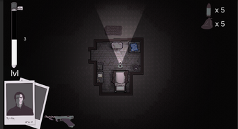
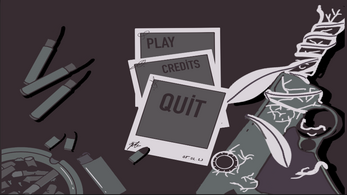
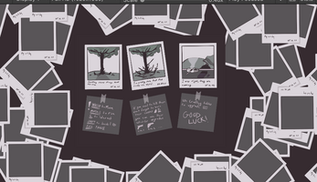
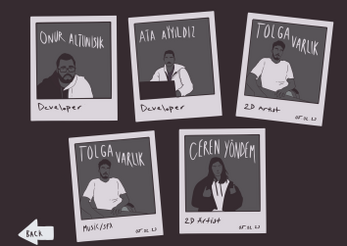

# GGJ23
# Burning The Roots
This game is made for GGJ23 at GameCricle location in 48 hours.

In this Survival  game you are killing and burning the roots, leveling up your weapons and saving the world!

## Story

<em>Young photographer Emmanuel who lives in the woods loves taking polaroid pictures. One day while he was taking photos of a tree close to his house he notices something unusual about the roots of this tree. He captures the phases of this roots growing out. Soon enough he sees some weird creatures that are coming for him from the forest.&nbsp;</em>

## How to play 
Goal of this game is to surviving as long as possible game is getting harder.
-  You can walk run and shoot.
-  Roots will attack you.
-  You can collect roots and burn.
-  Your weapon will get upgraded when you burn roots.
-  have fun. 

## Controls
-  Mouse to shoot .
-  You can pause by ESC .
-  Movement  WASD + SHIFT.

## Team:
-  Ata Ayyıldız - Developer  
-  Onur Altunışık - Developer 
-  Tolga Varlık - 2D Art
-  Ceren Yöndem - 2D Art

There is no external  Assets used in this game 

## Itch.io && GGJ23 site
-  You can downloand or play it  on web from this link : https://satas20.itch.io/burning-the-roots-global-game-jam
-  GGJ23  offical site https://globalgamejam.org/2023/games/burning-roots-6

## Preview

  Gameplay video : https://drive.google.com/file/d/1WuwnnBeJsI2uoM3CKdcYLvoYxtL7HESO/view?usp=sharing
  
  
  
  

<strong><del>Game is not finished and have many bugs in game </del>.</strong>

